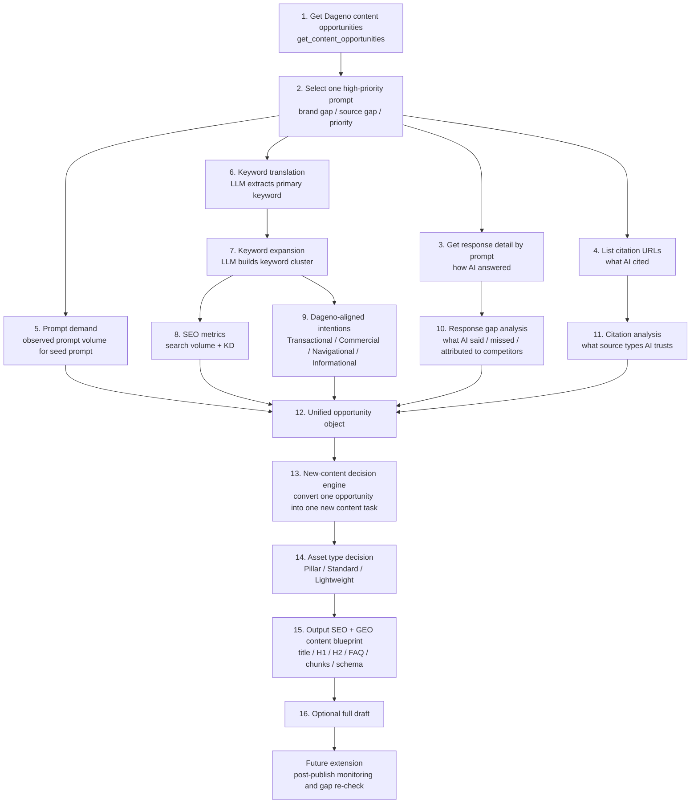

[](LICENSE)
[](skills/dageno-content-factory.md)
[](references/pipeline-spec.md)

# Dageno MCP Growth Playbook


> Turn Dageno content opportunities into new SEO + GEO content assets by analyzing response gaps, citation sources, keyword demand, and content intent.

## What This Project Is

This repo packages a Dageno-powered content agent as a reusable skill.

It is built for one focused use case:

> Every day, take the highest-value Dageno content opportunities, inspect how AI answered them, inspect what URLs were cited, and turn that evidence into brand-new content briefs or drafts.

This is not a site-maintenance workflow.

For now, the skill is designed only for **new content creation**:

- pick a prompt opportunity
- inspect the answer gap
- inspect the citation sources
- translate the prompt into SEO keyword demand
- decide what new content to create
- output a brief or full draft

Post-publish monitoring is intentionally kept as a future extension.

## Product Logic

Your Dageno project starts from a fixed prompt universe.

If a customer tracks `100` prompts, the system will not invent infinite prompt opportunities. Instead, it creates a continuous content machine by repeatedly detecting new or persistent gaps inside those tracked prompts:

- brand gap: competitors are mentioned but your brand is not
- source gap: AI cites sources that support others, not you
- response gap: the answer explains the topic but misses your product narrative, category fit, proof, or use case

That means the content unit should not be:

- one keyword
- or one chat

The right production logic is:

- `Prompt` defines the monitoring surface
- `Response detail` provides the gap evidence
- `Citation URLs` provide the source evidence
- `Content asset` is the final output

## What Makes This Different

Most content systems start from keyword research.

This one starts from **AI visibility gaps**:

1. Dageno shows where a prompt has high brand or source gap
2. response detail shows exactly how AI is framing the topic
3. citation URLs show which pages AI is trusting
4. keyword research translates that opportunity into SEO language
5. the agent decides what new content should exist

This makes the workflow much closer to the product's core value.

## Best For

- GEO teams that want to turn monitoring data into new articles
- SEO operators that need AI-gap-driven content ideas, not just keyword ideas
- agencies that want a repeatable prompt-to-brief workflow for clients
- founders who want a public or internal skill that demonstrates Dageno as an action layer

## Start With These Prompts

```text
Use Dageno Content Factory to turn today's highest-priority content opportunity into a new article brief.
```

```text
Analyze one Dageno content opportunity by reading the response detail and citation URLs, then recommend the best new content asset to create.
```

```text
Take the top brand-gap prompt from the last 7 days and generate an SEO + GEO content blueprint.
```

## Skill Entry Point

The main skill lives here:

- [`skills/dageno-content-factory.md`](skills/dageno-content-factory.md)

The pipeline reference lives here:

- [`references/pipeline-spec.md`](references/pipeline-spec.md)

## The Main Workflow



## Step By Step

### 1. Get content opportunities

Use Dageno's content-opportunity layer as the starting queue.

Primary source:

- `get_content_opportunities`

This is the candidate list for new content, not a generic keyword backlog.

### 2. Select one prompt opportunity

Choose the prompt based on:

- priority
- brand gap
- source gap
- platform coverage

This defines the next new-content task.

### 3. Read response detail

Use prompt-level response data to inspect how AI is currently answering that prompt.

Primary source:

- `Get response detail by prompt`

This step answers:

- what narrative AI is using
- what information is missing
- which competitors are being framed as relevant
- what product, category, or use-case language is absent

### 4. Read citation URLs

Use citation data to inspect which pages support the current answer.

Primary source:

- `List citation URLs`

This step answers:

- what domains and pages AI trusts
- what content formats are being cited
- what evidence structure those cited pages use

### 5. Add prompt-side demand

Get the real observed prompt demand for the seed prompt.

This is the GEO-side demand signal.

Important:

- the seed prompt can have real observed prompt volume
- fanout prompts currently do not

### 6. Translate the seed prompt into SEO language

Use the model to extract:

- one `primary_keyword`
- one `keyword_cluster`

This converts AI-native demand into search-native demand.

### 7. Add SEO metrics

Use your SEO connector to enrich the keyword cluster with:

- `search_volume`
- `keyword_difficulty`

This is the SEO-side demand and competition signal.

### 8. Add Dageno-aligned intentions

Classify each keyword using the Dageno intention model:

- `Transactional`
- `Commercial`
- `Navigational`
- `Informational`

This helps determine the correct asset type and article angle.

### 9. Run response gap analysis

This is a key layer.

The agent should not just observe that a gap exists. It should explain the gap:

- what AI is emphasizing
- what AI is omitting
- what competitors are credited for
- what narrative or evidence your brand lacks in the answer

### 10. Run citation analysis

If the user provides a page-fetch connector such as Jina or Firecrawl:

- fetch cited pages
- analyze structure, format, framing, and extractability

If not:

- fall back to URL, domain, title, and visible page-type hints

This turns citation data into writing guidance.

### 11. Build one unified opportunity object

The opportunity object should combine:

- prompt demand
- keyword demand
- intentions
- response-gap evidence
- citation evidence

This becomes the decision input for content generation.

### 12. Make a new-content decision

This skill only considers **new content**.

It does not yet decide whether to update existing pages.

The decision is:

- should this opportunity become a new content asset
- and if yes, what type

### 13. Choose the asset type

The default asset types are:

- `Pillar`
- `Standard`
- `Lightweight`

Use:

- `Pillar` for broad, high-demand, category-shaping opportunities
- `Standard` for clear standalone article opportunities
- `Lightweight` for narrower but still valuable content coverage

### 14. Output a content blueprint

The main output should be a structured blueprint:

- title
- H1
- H2/H3
- FAQ
- chunk plan
- schema recommendations
- citation-informed writing notes

### 15. Optionally output a full draft

If the user wants direct production, the skill can continue from blueprint to article draft.

### Future extension

The project should mention, but not depend on, a later monitoring loop:

- publish
- monitor the same prompt again
- observe whether brand gap or source gap shrinks

## Demand Model

This project uses two demand systems:

| Signal | Meaning | Source |
|---|---|---|
| observed prompt volume | real prompt-side demand for the seed prompt | Dageno prompt data |
| estimated prompt volume | proxy only for fanout prompts when direct prompt data is unavailable | model + keyword proxy |
| search volume | search demand in SEO language | SEO metrics connector |
| keyword difficulty | competition in SEO language | SEO metrics connector |

## Intention Model

Align to Dageno's intention structure:

```json
{
  "intentions": [
    {
      "score": 86,
      "intention": "Commercial"
    }
  ]
}
```

Supported values:

- `Transactional`
- `Commercial`
- `Navigational`
- `Informational`

## Connectors

| Layer | Status | Notes |
|---|---|---|
| Dageno content opportunities | ready | entry point |
| Dageno response detail | ready | answer-gap evidence |
| Dageno citation URLs | ready | source evidence |
| Dageno prompt demand | ready | observed seed prompt volume |
| SEO metrics | planned | search volume and KD |
| citation-page fetch | optional | Jina or Firecrawl |
| SERP enrichment | optional | approved SERP API or user-provided export |

## Plan A / Plan B

### Plan A

Use when the user provides:

- Dageno API access
- SEO metrics connector
- Jina or Firecrawl for cited-page fetching
- optional SERP connector

This enables a fuller article blueprint with stronger citation-based guidance.

### Plan B

Use when optional connectors are missing.

Fallback behavior:

- still use Dageno opportunity, response detail, and citation URLs
- still use the model for keyword translation and intention classification
- skip full page crawling if Jina / Firecrawl is unavailable
- skip SERP enrichment if no approved source exists
- still output a new-content blueprint

The workflow should degrade gracefully, not fail.

## What The Skill Produces

For each selected prompt opportunity, the agent can produce:

- a normalized opportunity object
- a response-gap summary
- a citation summary
- a keyword cluster with SEO demand and intention labels
- a new-content recommendation
- a content blueprint
- an optional article draft

## Existing Python Layer

This repo already includes:

- [`src/dageno_mcp_growth_playbook/client.py`](src/dageno_mcp_growth_playbook/client.py)
- [`src/dageno_mcp_growth_playbook/workflows.py`](src/dageno_mcp_growth_playbook/workflows.py)
- [`src/dageno_mcp_growth_playbook/cli.py`](src/dageno_mcp_growth_playbook/cli.py)

These remain useful as the API wrapper and workflow base.

## Quick Start

### Python / CLI

```bash
cd dageno-mcp-growth-playbook
python -m venv .venv
source .venv/bin/activate
pip install -r requirements.txt
export DAGENO_API_KEY="your-token"
PYTHONPATH=src python -m dageno_mcp_growth_playbook.cli content-opportunities --days 30
```

### Install As A Package

```bash
pip install -e .
dageno-playbook content-opportunities --days 30
```

### Use The Skill

Start from:

- [`skills/dageno-content-factory.md`](skills/dageno-content-factory.md)

Recommended runtime inputs:

- `DAGENO_API_KEY`
- optional SEO metrics API
- optional Jina or Firecrawl
- optional SERP connector

## Repo Structure

```text
dageno-mcp-growth-playbook/
├── README.md
├── LICENSE
├── manifest.json
├── agents/
│   └── openai.yaml
├── skills/
│   └── dageno-content-factory.md
├── references/
│   └── pipeline-spec.md
├── assets/
├── examples/
└── src/
```

## License

MIT
