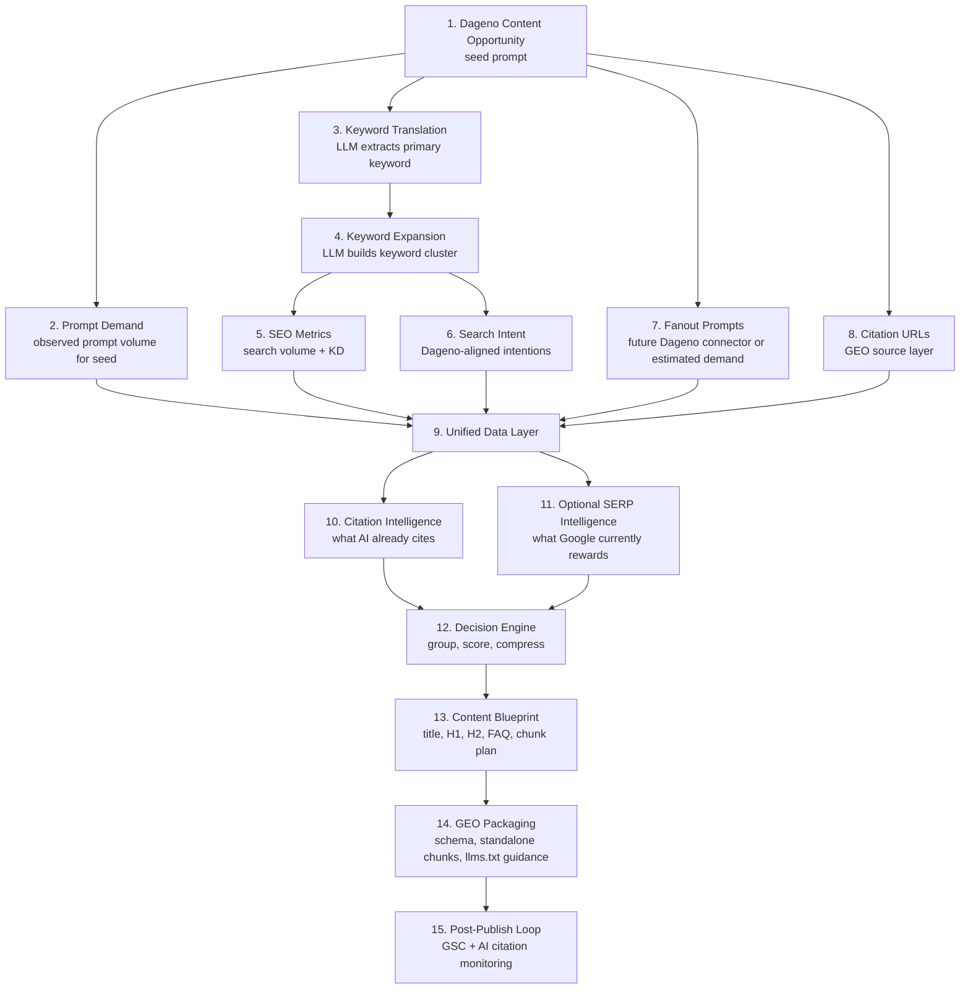

[](LICENSE)
[](skills/dageno-content-factory.md)
[](references/pipeline-spec.md)

# Dageno MCP Growth Playbook


> Turn one Dageno content opportunity into a structured SEO + GEO content plan, with prompt demand, keyword demand, citation intelligence, fallback-safe research, and publish-ready briefs.

## What This Project Is

This repo is now packaged as a reusable skill and playbook for teams building a data-driven content factory on top of Dageno.

It is designed for one practical job:

> Start with a Dageno seed prompt, combine GEO and SEO signals, compress dozens of variants into a small set of content assets, and output clear writing briefs instead of disconnected research notes.

In plain English:

- Dageno tells you which prompt opportunity exists
- the system measures AI-side demand and search-side demand separately
- the system studies which sources AI already cites
- the system optionally studies Google SERP patterns when safe connectors are available
- the system decides what should become a main article, a section, an FAQ block, or a GEO chunk

## What Makes This Different

Most content workflows start from a keyword list or from a blank AI prompt.

This project starts from **opportunity data** and keeps SEO and GEO as two separate but connected layers:

- `Prompt demand` tells you what users ask in AI-native language
- `Keyword demand` tells you what users search in Google-style language
- `Citation data` tells you what content AI engines already trust enough to cite
- `SERP data` tells you what Google currently rewards in rankings

That makes the output much more useful than a generic article generator.

## Best For

- GEO and SEO teams that want one content decision system instead of separate research steps
- agencies that need a repeatable way to turn Dageno opportunity data into content roadmaps
- founders building an internal or client-facing content factory
- operators who want briefs, chunk maps, FAQ structure, and schema guidance instead of loose notes

## Start With These Prompts

```text
Use Dageno Content Factory to turn our top content opportunities into a prioritized SEO + GEO content plan.
```

```text
Run the Dageno Content Factory workflow for the highest-priority prompt opportunity from the last 30 days.
```

```text
Analyze one Dageno seed prompt and tell me whether it should become a pillar page, a standard article, or lightweight GEO coverage.
```

## Skill Entry Point

The main skill lives here:

- [`skills/dageno-content-factory.md`](skills/dageno-content-factory.md)

Detailed pipeline notes live here:

- [`references/pipeline-spec.md`](references/pipeline-spec.md)

## Core Idea

One seed prompt does not equal one article.

The system first expands, scores, and compresses the opportunity:

1. Dageno provides the seed opportunity
2. Dageno prompt data provides observed prompt demand for the seed prompt
3. the model expands SEO keyword clusters and GEO fanout prompts
4. SEO connectors provide search volume and keyword difficulty
5. citation URLs reveal what AI engines are already citing
6. optional SERP analysis adds ranking-page intelligence
7. the system groups everything into a small number of content assets

The result is usually:

- `30-50` prompt or keyword candidates in research
- compressed into roughly `5-12` content assets
- each asset output as a brief, chunk plan, FAQ set, and schema guidance

## Pipeline Overview



## The Workflow, Step By Step

### 1. Get the seed prompt from Dageno

**What happens**

- call `get_content_opportunities`
- store the top opportunity and its base metadata

**Why it exists**

- this is the starting opportunity, not a guessed topic

**Output**

- `opportunity_id`
- `seed_prompt`
- source metadata such as market, language, and created time when available

### 2. Measure prompt-side demand

**What happens**

- look up the seed prompt in Dageno prompt data
- record its real observed prompt demand

**Why it exists**

- prompt demand is the GEO-side signal
- it tells you whether this topic matters in AI-native language

**Output**

- `observed_prompt_volume` for the seed prompt

### 3. Translate the seed prompt into SEO language

**What happens**

- use the model to extract the main keyword theme from the seed prompt

**Why it exists**

- a prompt is not the same thing as a keyword
- search engines and AI prompts speak different query languages

**Output**

- `primary_keyword`

### 4. Expand the keyword cluster

**What happens**

- use the model to expand related keywords, long-tail variations, and adjacent formulations

**Why it exists**

- one article usually targets a keyword set, not only one exact term

**Output**

- `keyword_candidates`

### 5. Add SEO demand signals

**What happens**

- fetch `search_volume` and `keyword_difficulty` from your SEO metrics connector

**Why it exists**

- this is the SEO-side demand and competition layer

**Output**

- `search_volume`
- `keyword_difficulty`

### 6. Add Dageno-aligned search intentions

**What happens**

- classify each keyword using the Dageno intention model:
  - `Transactional`
  - `Commercial`
  - `Navigational`
  - `Informational`

**Why it exists**

- content grouping should follow buying stage and information need, not only volume

**Output**

- `intentions[]` per keyword
- one cluster-level `dominant_intention`

### 7. Add fanout prompts

**What happens**

- when a Dageno fanout endpoint exists, use it
- until then, allow estimated fanout handling

**Why it exists**

- fanout prompts reveal how adjacent AI-native demand branches out from the seed prompt

**Important nuance**

- fanout prompts do **not** currently have real observed prompt volume
- they should use estimated demand fields such as:
  - `estimated_prompt_volume`
  - `volume_estimation_method`
  - `volume_confidence`

### 8. Add citation URLs

**What happens**

- pull `List citation URLs` for the seed prompt or prompt-level citation view

**Why it exists**

- this shows what URLs AI engines are already willing to cite

**Output**

- `citation_urls`

### 9. Merge everything into the unified data layer

**What happens**

- combine prompt-side, keyword-side, and citation-side data into one decision object

**Why it exists**

- later decisions should use one complete object instead of scattered raw data

**Output**

- one normalized opportunity record

### 10. Run citation intelligence

**What happens**

- inspect cited pages and infer what content formats AI prefers

**Why it exists**

- citation structure is one of the strongest GEO writing signals

**Preferred connector**

- user-provided `Jina` or `Firecrawl`

**Fallback**

- if no page-fetch connector exists, analyze URL, domain, title, and page-type hints only

### 11. Run optional SERP intelligence

**What happens**

- inspect ranking pages, PAA, snippets, and AI Overview when safe connectors are available

**Why it exists**

- SERP patterns tell you what Google currently rewards

**Plan A**

- use an approved SERP API or user-provided SERP export

**Plan B**

- skip or sample SERP analysis if large-scale Google fetching is risky or unavailable

This is intentionally an enhancement layer, not a hard dependency.

### 12. Compress the opportunity into content assets

**What happens**

- group by intent, topic overlap, SEO demand, prompt demand, and citation evidence

**Why it exists**

- the goal is not one article per term
- the goal is a small, sensible content system

**Typical outputs**

- pillar article
- standard article
- lightweight article
- FAQ cluster
- GEO chunk block

### 13. Generate the content blueprint

**What happens**

- produce a brief, not just a keyword list

**Output**

- recommended title
- H1
- H2/H3 structure
- FAQ list
- evidence requirements
- citation-informed writing notes

### 14. Package the GEO layer

**What happens**

- create standalone chunk guidance and schema recommendations

**Why it exists**

- content should be easier for AI systems to extract and cite

**Output**

- standalone chunk plan
- FAQ schema guidance
- article schema guidance
- `llms.txt` guidance

### 15. Close the loop after publishing

**What happens**

- monitor GSC and AI citation behavior

**Why it exists**

- this is how the system decides whether to keep content merged or split it later

**Typical actions**

- keep merged
- split high-performing sections into standalone pages
- enrich FAQs
- rewrite chunks

## Prompt Demand vs Search Demand

This project treats these as separate measurements.

| Signal | What It Means | Source |
|---|---|---|
| observed prompt volume | real demand seen in prompt data | Dageno prompt layer |
| estimated prompt volume | proxy demand for fanout prompts without direct observation | model + SEO proxy logic |
| search volume | search demand in keyword language | SEO metrics connector |
| keyword difficulty | ranking competition | SEO metrics connector |

This distinction matters because one seed prompt may be strong in AI-native demand while still mapping to weak or fragmented search demand.

## Dageno-Aligned Intention Model

The skill should align keyword intentions to the Dageno format:

- `Transactional Intent`
- `Commercial Intent`
- `Navigational Intent`
- `Informational Intent`

Recommended structure:

```json
{
  "intentions": [
    {
      "score": 86,
      "intention": "Commercial"
    }
  ]
}
```

## Connectors

| Layer | Status | Notes |
|---|---|---|
| Dageno content opportunities | ready | seed prompt source |
| Dageno prompt volume | ready | observed demand for seed prompt |
| Dageno citation URLs | ready | GEO source intelligence |
| Dageno fanout prompts | planned | keep connector slot ready |
| SEO search volume / KD | planned | user-supplied API slot |
| page fetch for citation URLs | optional | user can provide Jina or Firecrawl |
| SERP data | optional | approved API or user-provided export |

## Plan A / Plan B

### Plan A: full workflow

Use when the user provides:

- Dageno API access
- SEO metrics connector
- page fetch connector such as Jina or Firecrawl
- optional SERP connector

Best for:

- full analysis
- citation-page structure mining
- stronger SEO and GEO recommendation quality

### Plan B: safe fallback

Use when one or more connectors are missing.

Fallback behavior:

- keep Dageno opportunity and citation inputs
- keep keyword expansion and intention mapping
- skip full citation page fetch if Jina / Firecrawl is missing
- skip or sample SERP analysis if no safe connector exists
- still produce a content blueprint

The project should never fail just because a non-core connector is missing.

## What The Skill Produces

For each prioritized seed prompt, the system can produce:

- a normalized opportunity object
- a keyword cluster with demand and intention labels
- a fanout prompt set with estimated demand when needed
- citation-source analysis and writing recommendations
- a content decision such as pillar / standard / lightweight
- a brief with title, H1, H2, FAQ, and evidence guidance
- GEO chunk packaging and schema recommendations

## Existing Python Layer

The repo already includes a lightweight Python client and workflow helpers:

- [`src/dageno_mcp_growth_playbook/client.py`](src/dageno_mcp_growth_playbook/client.py)
- [`src/dageno_mcp_growth_playbook/workflows.py`](src/dageno_mcp_growth_playbook/workflows.py)
- [`src/dageno_mcp_growth_playbook/cli.py`](src/dageno_mcp_growth_playbook/cli.py)

These are useful building blocks for:

- Dageno API connectivity
- initial reporting workflows
- demos and CLI-based inspection

## Quick Start

### Python / CLI

```bash
cd dageno-mcp-growth-playbook
python -m venv .venv
source .venv/bin/activate
pip install -r requirements.txt
export DAGENO_API_KEY="your-token"
PYTHONPATH=src python -m dageno_mcp_growth_playbook.cli weekly-brief --days 30
```

### Install As A Package

```bash
pip install -e .
dageno-playbook weekly-brief --days 30
```

### Use The Skill

Start from:

- [`skills/dageno-content-factory.md`](skills/dageno-content-factory.md)

Then provide:

- one Dageno project
- one Dageno API key
- optional SEO metrics connector
- optional Jina or Firecrawl credentials
- optional SERP connector or exported SERP snapshots

## Repo Structure

```text
dageno-mcp-growth-playbook/
├── README.md
├── LICENSE
├── manifest.json
├── agents/
│   └── openai.yaml
├── skills/
│   └── dageno-content-factory.md
├── references/
│   └── pipeline-spec.md
├── assets/
├── examples/
└── src/
```

## Why This Repo Is Useful Even Before All Connectors Are Final

This project already gives you:

- a stable narrative for the product
- a clear SEO + GEO dual-demand model
- a fallback-safe research pipeline
- a reusable skill entry point for testing

And it leaves clean extension points for:

- SEO search volume / KD APIs
- Dageno fanout prompt connectors
- citation page crawling
- safe SERP enrichment

## License

MIT
