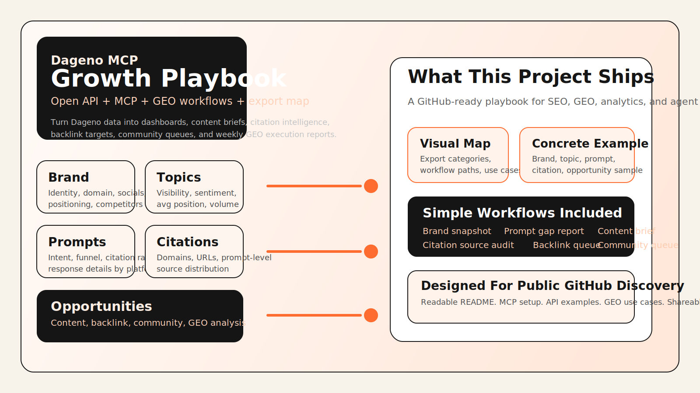
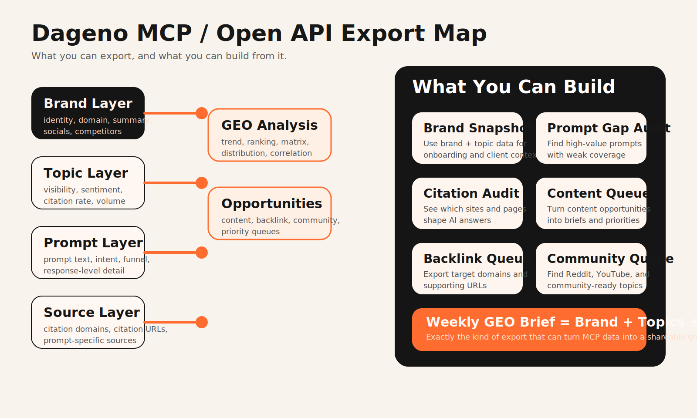

[](LICENSE)
[](https://mkt3dcy1n7.apidog.io/2055617m0)
[](https://mkt3dcy1n7.apidog.io/)
[](src/dageno_mcp_growth_playbook/workflows.py)

# Dageno MCP Growth Playbook



> Turn Dageno Open API and MCP data into GEO reporting, citation intelligence, prompt-gap analysis, content opportunity queues, backlink targets, and community distribution workflows.

**Positioning**

`Dageno MCP Growth Playbook` is a GitHub-ready project for operators who want more than API docs.

It packages the Dageno Open API and MCP server into a practical growth workflow that helps teams:

- understand what data Dageno exposes
- turn raw GEO metrics into readable reports
- connect prompts, citations, and opportunities into execution logic
- build lightweight internal tools, dashboards, and AI-agent workflows
- create a public-facing project that is both useful and discoverable for SEO / GEO audiences

This repo is designed to answer a practical question:

> If I have Dageno MCP and Open API access, what exactly can I export, and how do I turn it into a repeatable GEO operating system?

**Outcome**

Instead of leaving the docs as a set of endpoints, this project turns them into:

- one public explanation layer
- one visual export map
- one concrete example
- one lightweight Python client
- multiple simple workflows that can be reused, extended, or demoed

## What This Repo Includes

- a GitHub-friendly `README.md` with positioning, examples, and setup
- a visual export map in [`assets/data-map.svg`](assets/data-map.svg)
- a lightweight Python client in [`src/dageno_mcp_growth_playbook/client.py`](src/dageno_mcp_growth_playbook/client.py)
- simple workflow implementations in [`src/dageno_mcp_growth_playbook/workflows.py`](src/dageno_mcp_growth_playbook/workflows.py)
- a CLI in [`src/dageno_mcp_growth_playbook/cli.py`](src/dageno_mcp_growth_playbook/cli.py)
- ready-to-copy MCP config in [`examples/cursor-mcp.json`](examples/cursor-mcp.json)
- sample outputs in [`examples/brand-snapshot.md`](examples/brand-snapshot.md) and [`examples/weekly-growth-brief.md`](examples/weekly-growth-brief.md)

## Why It Feels Different

Most API wrappers stop at:

- endpoint lists
- auth instructions
- a few cURL examples

That is not enough for GEO teams, SEO operators, agencies, or founders who need to answer:

- which topics matter most right now
- which prompts are high-value but under-covered
- which sources dominate AI citation graphs
- what content should be created next
- what backlink or community opportunities deserve attention

This project is built to bridge:

- `docs -> data -> workflows -> execution`

## Data Export Map



The Dageno MCP / Open API can export these data layers:

- `brand layer`
  - name, domain, tagline, description, socials, project context
- `topic layer`
  - visibility, visibility delta, sentiment, average position, citation rate, volume
- `prompt layer`
  - prompt text, intent, funnel stage, creation date, visibility, sentiment, citation rate, volume
- `response layer`
  - prompt-level answer content by platform and date
- `citation layer`
  - cited domains, cited URLs, prompt-level citation domains, prompt-level citation URLs
- `opportunity layer`
  - content opportunities
  - backlink opportunities
  - community opportunities
- `analysis layer`
  - GEO DSL analysis for ranking, trend, distribution, correlation, and matrix views

## What You Can Build From The Data

| Export Type | Example Output | What You Can Do |
|---|---|---|
| Brand | brand snapshot | onboard new clients, ground AI-agent context, create internal project summaries |
| Topics | topic watchlist | see which GEO themes deserve more budget, content, or monitoring |
| Prompts | prompt gap report | identify missing or underperforming answer-engine coverage |
| Prompt Responses | response review | analyze how different platforms describe the brand |
| Citation Domains | source audit | see which domains shape the AI citation graph |
| Citation URLs | page audit | locate specific pages worth replicating, contesting, or targeting |
| Content Opportunities | publishing queue | prioritize content briefs and topic clusters |
| Backlink Opportunities | outreach queue | export high-priority backlink targets |
| Community Opportunities | distribution queue | identify Reddit, YouTube, and community-native distribution plays |
| GEO Analysis | trend / ranking / matrix report | build dashboards and executive summaries |

## Concrete Example

Here is the kind of real data path this repo is built around:

1. brand info says the project is `Dageno` on `dageno.ai`
2. top topics include `Brand Narrative Control` and `AI Visibility Monitoring`
3. prompt-level exports show transactional BOFU prompts such as `AI visibility monitoring platform pricing and features`
4. citation exports show domains like `reddit.com` and `searchengineland.com`
5. content opportunities surface prompts like `GEO implementation guide for technical teams`
6. community opportunities surface distribution candidates across YouTube and Reddit

That means one API stack can power:

- a GEO dashboard
- a content backlog
- a citation intelligence layer
- a backlink queue
- a community distribution queue

See:

- [`examples/brand-snapshot.md`](examples/brand-snapshot.md)
- [`examples/weekly-growth-brief.md`](examples/weekly-growth-brief.md)

## Implemented Workflows

The repo ships with simple, readable workflows that map directly to practical GEO execution:

| Workflow | What It Does | CLI |
|---|---|---|
| brand snapshot | export project basics and positioning context | `dageno-playbook brand-snapshot` |
| topic watchlist | list the strongest topics over a time window | `dageno-playbook topic-watchlist --days 30` |
| prompt gap report | rank high-value prompts to review or expand | `dageno-playbook prompt-gap --days 30` |
| citation source brief | show the top cited domains and URLs | `dageno-playbook citation-brief --days 30` |
| content opportunity brief | create a content priority queue | `dageno-playbook content-opportunities --days 30` |
| backlink opportunity brief | create a backlink target list | `dageno-playbook backlink-opportunities --days 30` |
| community opportunity brief | create a community distribution queue | `dageno-playbook community-opportunities --days 30` |
| prompt deep dive | inspect one prompt's responses and sources | `dageno-playbook prompt-deep-dive <prompt_id>` |
| weekly exec brief | combine the main layers into one report | `dageno-playbook weekly-brief --days 30` |

## REST Quick Start

```bash
cd dageno-mcp-growth-playbook
python -m venv .venv
source .venv/bin/activate
pip install -r requirements.txt
export DAGENO_API_KEY="your-token"
PYTHONPATH=src python -m dageno_mcp_growth_playbook.cli brand-snapshot
```

You can also install it as a package:

```bash
pip install -e .
dageno-playbook weekly-brief --days 30
```

## MCP Setup

### Claude Code

```bash
claude mcp add --transport http dageno https://api.dageno.ai/mcp \
  --header "x-api-key: your-token"
```

### Cursor

Use [`examples/cursor-mcp.json`](examples/cursor-mcp.json).

The MCP server lets you ask for:

- brand basics
- visibility analysis
- content opportunities
- topic and prompt summaries
- citation source analysis
- prompt-level deep dives
- backlink and community opportunity ranking

## Example MCP Prompts

```text
Please analyze the brand basics of the current project and summarize positioning, core keywords, and main competitors.
```

```text
Please evaluate the current project's visibility performance over the past month, and provide key findings and trend insights.
```

```text
What content opportunities are available for the current project? Please rank the top three by priority and explain why.
```

```text
Please analyze the most frequently cited domains and page URLs over the past month, and summarize the key source patterns.
```

## Why This Matters For SEO And GEO

Most teams still separate:

- SEO reporting
- GEO monitoring
- citation analysis
- content planning
- authority building
- community distribution

That separation slows execution.

Dageno's data model is useful because it ties together:

- how brands appear
- which prompts matter
- who gets cited
- what content is missing
- where authority and distribution opportunities live

In practice, that means you can turn MCP / Open API exports into:

- internal dashboards
- client-facing GEO reports
- monthly strategy decks
- prompt coverage audits
- content roadmaps
- backlink and community execution queues

## Repo Structure

```text
dageno-mcp-growth-playbook/
├── README.md
├── LICENSE
├── requirements.txt
├── pyproject.toml
├── assets/
│   ├── cover.svg
│   └── data-map.svg
├── examples/
│   ├── brand-snapshot.md
│   ├── cursor-mcp.json
│   ├── geo-analysis-payload.json
│   └── weekly-growth-brief.md
└── src/
    └── dageno_mcp_growth_playbook/
        ├── __init__.py
        ├── cli.py
        ├── client.py
        └── workflows.py
```

## Recommended Use Cases

- publish a strong GitHub explainer around Dageno MCP and Open API
- show prospects what GEO data can be exported before they buy
- create internal agent workflows on top of Dageno data
- turn API docs into a lead-generation asset
- bridge SEO, GEO, citation intelligence, and execution planning

## References

- [Dageno Open API Docs](https://mkt3dcy1n7.apidog.io/)
- [Dageno MCP Docs](https://mkt3dcy1n7.apidog.io/2055617m0)
- [GEO Analysis Guide](https://mkt3dcy1n7.apidog.io/2055618m0)

## License

MIT
