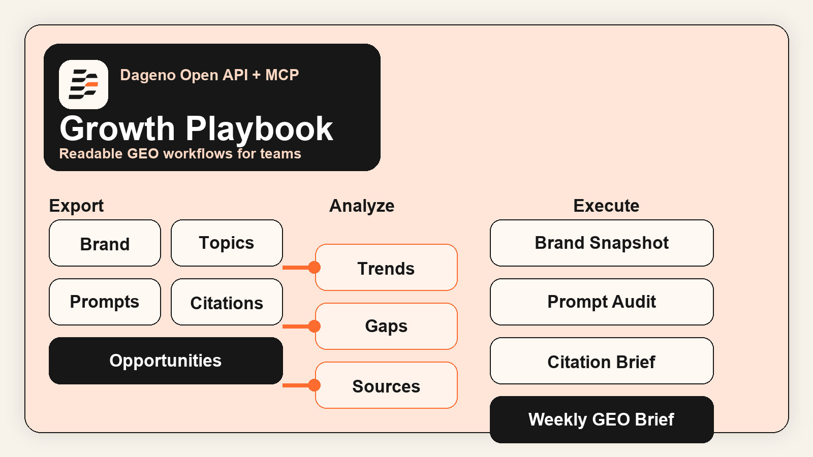
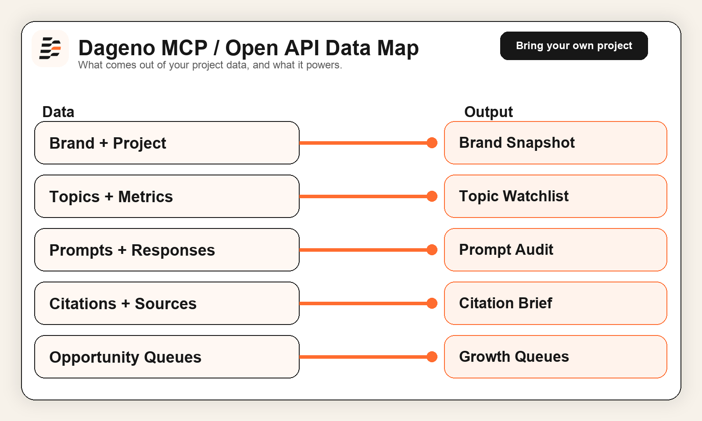

[](LICENSE)
[](https://mkt3dcy1n7.apidog.io/2055617m0)
[](https://mkt3dcy1n7.apidog.io/)
[](src/dageno_mcp_growth_playbook/workflows.py)

# Dageno MCP Growth Playbook



> Turn Dageno MCP and Open API data into GEO reports, citation intelligence, prompt-gap audits, content queues, backlink targets, and community workflows.

This repo does **not** include a shared Dageno project or a shared API key.
Each user connects their **own** Dageno project and **own** `x-api-key`.

**Positioning**

`Dageno MCP Growth Playbook` is a public-facing project for teams that want to do more than read API docs.

It turns the Dageno API surface into a usable GEO operating layer:

- a readable explainer for founders, agencies, and operators
- a visual map of what data can be exported
- a concrete example based on real Dageno output
- a lightweight Python client
- simple workflows you can run, demo, extend, or plug into agents

This repo is built to answer a practical question:

> If I already have Dageno access, how do I turn it into something a team can actually use, share, and build on?

## The Problem

Most API projects stop at:

- endpoint lists
- auth instructions
- a few request examples

That is not enough for SEO and GEO operators who need to decide:

- which topics matter most right now
- which prompts are worth chasing
- which domains dominate the citation graph
- what content should be published next
- what outreach or community actions deserve priority

## The Promise

This repo bridges:

- `docs -> exports -> analysis -> workflows -> execution`

In plain English:

- it helps people understand what Dageno exposes
- it helps teams turn raw data into readable outputs
- it helps agencies and operators show value faster
- it gives your GitHub account a clearer GEO product story

## Best For

- GEO and SEO operators building internal workflows
- agencies that want a public explainer before a sales call
- founders who need a tangible MCP / API demo
- product and growth teams building dashboards or AI-agent layers
- open-source visitors who need to understand Dageno in 60 seconds

## For Different Teams

### For Agencies

- use this repo as a pre-sales explainer before strategy calls
- turn Dageno exports into recurring GEO reports, citation audits, and execution queues
- show clients a clearer line from monitoring data to deliverables

### For Founders

- turn MCP and API access into a stronger product narrative
- show prospects that Dageno is a workflow layer, not just a dashboard
- publish a repo that improves credibility, discoverability, and technical trust

### For Internal GEO Teams

- standardize weekly reporting across brand, prompt, citation, and opportunity layers
- convert exports into content, backlink, and community task queues
- use the included client and workflows as a base for internal dashboards and AI agents

## What This Repo Includes

- a GitHub-first `README.md` with positioning, use cases, setup, and examples
- a readable export map in [`assets/data-map-v3.png`](assets/data-map-v3.png)
- a share-ready social image in [`assets/social-preview.png`](assets/social-preview.png)
- a lightweight client in [`src/dageno_mcp_growth_playbook/client.py`](src/dageno_mcp_growth_playbook/client.py)
- reusable workflows in [`src/dageno_mcp_growth_playbook/workflows.py`](src/dageno_mcp_growth_playbook/workflows.py)
- a CLI in [`src/dageno_mcp_growth_playbook/cli.py`](src/dageno_mcp_growth_playbook/cli.py)
- MCP setup examples in [`examples/cursor-mcp.json`](examples/cursor-mcp.json)
- sample outputs in [`examples/brand-snapshot.md`](examples/brand-snapshot.md), [`examples/weekly-growth-brief.md`](examples/weekly-growth-brief.md), and [`examples/live-30-day-example.md`](examples/live-30-day-example.md)

## What Dageno Can Export

The Dageno MCP / Open API exposes data across these layers:

| Layer | Typical Fields | What It Helps You Do |
|---|---|---|
| Brand | name, domain, tagline, description, socials, competitors | build project context, onboard clients, ground AI-agent prompts |
| Topics | visibility, sentiment, avg position, citation rate, volume | see which GEO themes matter most |
| Prompts | prompt text, intent, funnel, visibility, citation rate, volume | identify prompt gaps and decision-stage opportunities |
| Responses | prompt-level AI answer content by platform and date | inspect how models actually describe the brand |
| Citations | domains, URLs, prompt-level source breakdown | map the source graph behind AI answers |
| Opportunities | content, backlink, community | turn monitoring into execution queues |
| GEO Analysis | ranking, trend, matrix, distribution, correlation | build dashboards and strategic reports |

## Current API Coverage

This repo is the base wrapper and workflow layer, not the full content engine.

Below is the current implementation status in this repository:

| API Area | Status | Notes |
|---|---|---|
| Brand info | Implemented | wrapped in `DagenoClient.brand_info()` |
| GEO analysis | Implemented | wrapped in `DagenoClient.geo_analysis()` |
| Topics | Implemented | wrapped in `DagenoClient.topics()` |
| Prompts | Implemented | wrapped in `DagenoClient.prompts()` |
| Prompt responses | Implemented | list + detail are both wrapped |
| Citation domains / URLs | Implemented | global and prompt-level endpoints are wrapped |
| Content / backlink / community opportunities | Implemented | wrapped and exposed in workflows |
| Query fanout by prompt | Implemented | wrapped in `DagenoClient.prompt_query_fanout()` |
| Keyword volume | Implemented | wrapped in `DagenoClient.keyword_volume()` |
| Content-pack generation | Not in this repo | moved to the separate content project |
| GEO-first article generation | Not in this repo | moved to the separate content project |

If you want:

- opportunity tiering
- content packs
- asset tables
- GEO writing guidance
- article or landing-page generation

use the separate content project instead of this base wrapper repo.

## Data Export Map



## Social Preview Asset

If you want a cleaner share card for GitHub, X, LinkedIn, or docs portals, use:

- [`assets/social-preview.png`](assets/social-preview.png)

## What You Can Build From The Data

| Output | Why It Matters |
|---|---|
| brand snapshot | creates onboarding context for a client, operator, or AI agent |
| topic watchlist | tells you which GEO themes deserve more budget and attention |
| prompt gap report | surfaces high-value prompts with weak or incomplete coverage |
| citation audit | shows which domains and pages shape AI answers |
| content queue | turns opportunity data into briefs and publishing priorities |
| backlink queue | turns source data into authority-building targets |
| community queue | turns opportunity data into Reddit, YouTube, and distribution plays |
| weekly GEO brief | combines the key layers into one readable report |

## Real Example: 30-Day Snapshot

Below is a real example pattern this repo is designed to produce.

Sample window:

- last `30` days
- project: `Dageno`
- generated from the included CLI workflows
- requires a Dageno project with accessible data

Observed themes from a sample run:

- top topics included `Brand Narrative Control` and `AI Visibility Monitoring`
- strong BOFU prompts included `AI visibility monitoring platform pricing and features`
- top citation domains included `reddit.com` and `searchengineland.com`
- top content opportunities included `Enterprise AEO solutions for brand authority`
- top community opportunities included YouTube and Reddit entries tied to AEO / GEO prompts

The important part is not the single metric snapshot.

The important part is the structure:

1. brand context
2. topic performance
3. prompt coverage
4. source graph
5. opportunity queue

That is the foundation for:

- a GEO dashboard
- a strategy memo
- a content backlog
- an outreach queue
- a weekly team brief

See the concrete sample:

- [`examples/live-30-day-example.md`](examples/live-30-day-example.md)

## Implemented Workflows

This repo ships with simple, readable workflows that map directly to real GEO execution:

| Workflow | What It Produces | CLI |
|---|---|---|
| brand snapshot | core project context | `dageno-playbook brand-snapshot` |
| topic watchlist | strongest topics in a time window | `dageno-playbook topic-watchlist --days 30` |
| prompt gap report | high-value prompts to review or expand | `dageno-playbook prompt-gap --days 30` |
| citation source brief | top cited domains and URLs | `dageno-playbook citation-brief --days 30` |
| content opportunity brief | content priority queue | `dageno-playbook content-opportunities --days 30` |
| backlink opportunity brief | backlink target list | `dageno-playbook backlink-opportunities --days 30` |
| community opportunity brief | community distribution queue | `dageno-playbook community-opportunities --days 30` |
| query fanout brief | prompt adjacency / fanout view | `dageno-playbook query-fanout <prompt_id> --days 7` |
| keyword volume brief | keyword volume lookup | `dageno-playbook keyword-volume "keyword one" "keyword two"` |
| prompt deep dive | prompt-level response and source breakdown | `dageno-playbook prompt-deep-dive <prompt_id>` |
| weekly exec brief | one combined report | `dageno-playbook weekly-brief --days 30` |

## Quick Start

### REST / Python

```bash
cd dageno-mcp-growth-playbook
python -m venv .venv
source .venv/bin/activate
pip install -r requirements.txt
export DAGENO_API_KEY="your-token"
PYTHONPATH=src python -m dageno_mcp_growth_playbook.cli brand-snapshot
```

Package install:

```bash
pip install -e .
dageno-playbook weekly-brief --days 30
```

Inspect prompt fanout:

```bash
dageno-playbook query-fanout 673c9c68-b400-4cab-ae78-66925f06eab3 --days 7
```

Check keyword volume:

```bash
dageno-playbook keyword-volume "answer engine optimization tools" "enterprise aeo solutions"
```

### MCP Setup

#### Claude Code

```bash
claude mcp add --transport http dageno https://api.dageno.ai/mcp \
  --header "x-api-key: your-token"
```

#### Cursor

Use [`examples/cursor-mcp.json`](examples/cursor-mcp.json).

## Who Needs What

To use this project, a customer needs:

- a Dageno project
- an API key for that project
- enough project data for topics, prompts, citations, and opportunities to return useful results

This repo is the wrapper and workflow layer.
It is not a public demo dataset.

## Example MCP Prompts

```text
Please analyze the brand basics of the current project and summarize positioning, core keywords, and main competitors.
```

```text
Please evaluate the current project's visibility performance over the past month, and provide key findings and trend insights.
```

```text
What content opportunities are available for the current project? Please rank the top three by priority and explain why.
```

```text
Please analyze the most frequently cited domains and page URLs over the past month, and summarize the key source patterns.
```

```text
Please inspect the query fanout around one high-value prompt and summarize the adjacent demand patterns.
```

```text
Please look up keyword volume for a shortlist of AEO- and GEO-related phrases and compare them.
```

## Why This Repo Works As A Growth Asset

This repo is not only useful for developers.

It is also useful for:

- prospect education before a demo call
- client onboarding after a sale
- internal enablement for GEO operators
- content marketing around MCP, GEO, and AI visibility
- showing that Dageno is not just a dashboard, but a usable data layer

That makes it a good public asset for:

- GitHub discovery
- GEO thought leadership
- API product storytelling
- founder-led distribution

## API Notes

During implementation and testing, these points mattered:

- auth uses the `x-api-key` header
- most list endpoints require both `startAt` and `endAt`
- the backlink opportunity path is `/v1/open-api/opportunities/backlink`
- the MCP endpoint is `https://api.dageno.ai/mcp`

## Repo Structure

```text
dageno-mcp-growth-playbook/
├── README.md
├── LICENSE
├── requirements.txt
├── pyproject.toml
├── assets/
│   ├── cover.svg
│   ├── cover-v2.svg
│   ├── cover-v3.png
│   ├── data-map.svg
│   ├── data-map-v2.svg
│   ├── data-map-v3.png
│   ├── dageno-logo.png
│   └── social-preview.png
├── examples/
│   ├── brand-snapshot.md
│   ├── cursor-mcp.json
│   ├── geo-analysis-payload.json
│   ├── live-30-day-example.md
│   └── weekly-growth-brief.md
└── src/
    └── dageno_mcp_growth_playbook/
        ├── __init__.py
        ├── cli.py
        ├── client.py
        └── workflows.py
```

## Recommended Use Cases

- publish a clearer GitHub explainer around Dageno MCP and Open API
- show prospects what GEO data can be exported before they buy
- create internal agent workflows on top of Dageno data
- turn documentation into a lead-generation asset
- bridge SEO, GEO, citation intelligence, and execution planning

## References

- [Dageno Open API Docs](https://mkt3dcy1n7.apidog.io/)
- [Dageno MCP Docs](https://mkt3dcy1n7.apidog.io/2055617m0)
- [GEO Analysis Guide](https://mkt3dcy1n7.apidog.io/2055618m0)

## License

MIT
