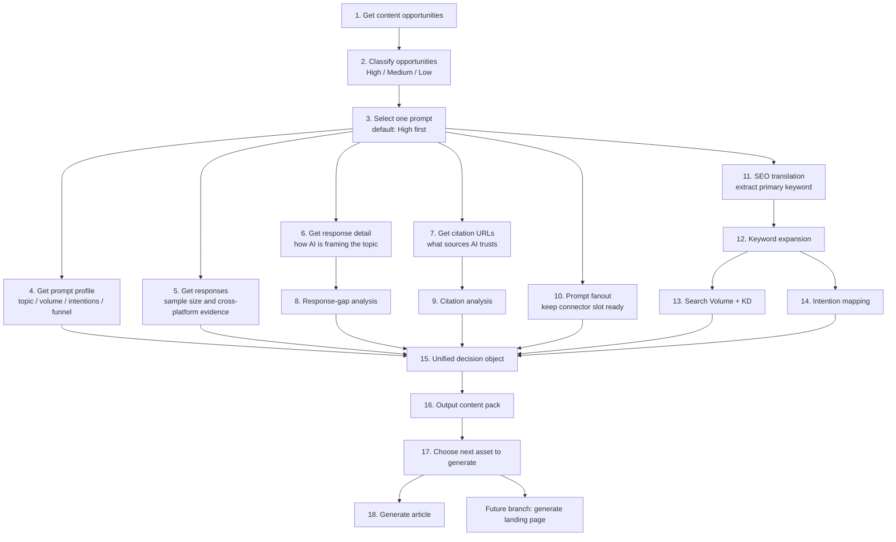

[](LICENSE)
[](skills/dageno-content-factory.md)
[](references/pipeline-spec.md)

# Dageno MCP Growth Playbook


> Turn Dageno content opportunities into SEO + GEO content packs by combining brand-gap evidence, citation evidence, prompt fanout, keyword demand, and structured content decisions.

## What This Project Is

This repo packages a Dageno-powered content agent as a reusable skill.

It is built for one practical job:

> Start from Dageno content opportunities, identify which prompts matter most, inspect how AI is answering them, inspect what sources AI trusts, expand the prompt into adjacent demand, and output a reusable content pack instead of just one article.

This is not only a reporting workflow.
This is not only a keyword workflow.

It is a **content opportunity operating system** for SEO + GEO teams.

## Core Product Idea

The core insight behind this skill is:

**High-value content opportunities do not always have high prompt volume.**

That matters because many important AI-search opportunities are invisible if you only look at raw volume.

Dageno becomes valuable when it helps teams find prompts where:

- the brand gap is high
- the source gap is high
- AI keeps answering the prompt across platforms
- competitors or adjacent entities are being included
- your brand is still missing

That is a stronger signal than volume alone.

## What The Agent Should Do

For each run, the agent should:

1. classify opportunities into `High / Medium / Low`
2. default to `High` opportunities first
3. allow the user to choose a specific prompt if they want
4. inspect responses and response detail
5. inspect citation URLs and source structure
6. run prompt fanout
7. translate prompt demand into SEO keyword demand
8. enrich with search volume, KD, and intention
9. output a **content pack**
10. then optionally choose one article or one future landing page to generate

## Why This Is Better Than One-Article Generation

One heavy round of analysis should not produce only one article.

The right unit is:

- one high-opportunity prompt
- one evidence pass
- one fanout layer
- one SEO/GEO merge
- one reusable content pack

That content pack can then feed:

- multiple articles
- future landing pages
- future docs pages
- future comparison pages

This is how the workflow scales without wasting tokens.

## Opportunity Tiers

The agent should classify all prompts into three tiers.

### High Opportunity

Typical traits:

- very high brand gap
- very high source gap
- enough response count to show the gap is stable
- prompt strongly aligned with product narrative or commercial intent

Use this as the default queue.

### Medium Opportunity

Typical traits:

- some real gap exists
- either demand, stability, or commercial closeness is weaker

Good for the second queue.

### Low Opportunity

Typical traits:

- weaker gap
- low sample size
- lower business relevance

Keep visible, but do not prioritize first.

## Main Workflow



## Why The Order Matters

### Evidence first

The agent should not jump from prompt to article.

It should first confirm:

- is the gap real
- is the gap stable
- how AI is currently framing the topic
- what source patterns dominate the answer space

### Fanout before final content selection

Prompt fanout should happen before the final content decision.

Why:

- one prompt should expand into adjacent prompt opportunities
- this is how the system creates a content pack instead of a single article

### SEO and GEO must merge

The system should not stop at AI-answer evidence.
It also needs:

- keyword translation
- keyword expansion
- search volume
- KD
- intention

Only then should it decide what to create.

## What The Agent Produces

The primary output is a **content pack**, not just a draft.

For one high-opportunity prompt, the pack should include:

- selected prompt and opportunity tier
- prompt profile
- response-gap summary
- citation summary
- fanout prompt set
- keyword cluster
- search metrics and intentions
- recommended asset list
- recommended order of creation

Then the user can choose:

- article
- future landing page
- future supporting asset

## Future Branches

This project should explicitly leave room for:

### 1. Landing page generation

Why:

- landing pages are often more direct for SEO conversion and commercial capture
- the current citation pattern may suggest educational content first, but landing pages should remain a planned branch

### 2. Existing-content refresh

Not the current priority.
Keep it as a future branch.

### 3. Post-publish monitoring loop

Also future:

- publish
- re-monitor
- see whether brand gap or source gap shrinks

## Connectors

| Layer | Status | Notes |
|---|---|---|
| Dageno content opportunities | ready | source queue |
| Dageno prompt profile | ready | topic, volume, intentions, funnel |
| Dageno responses | ready | cross-platform evidence |
| Dageno response detail | ready | response-gap evidence |
| Dageno citation URLs | ready | source evidence |
| prompt fanout | reserved | connector slot should stay in workflow |
| SEO search volume / KD | reserved | connector slot should stay in workflow |
| landing page generation | future branch | keep in architecture |

## Recommended Runtime Flow

### 1. Review tiers

Start by listing:

- High Opportunity
- Medium Opportunity
- Low Opportunity

Default to High first.

### 2. Pick a prompt

If the user does not pick one, use the highest-priority item from the High tier.

### 3. Build the evidence layer

Inspect:

- prompt profile
- responses
- response detail
- citation URLs

### 4. Expand the opportunity

Run:

- prompt fanout
- keyword translation
- keyword expansion
- SEO metrics
- intentions

### 5. Output the content pack

Do not collapse everything into one article too early.

## Existing Python Layer

The repo already includes:

- [`src/dageno_mcp_growth_playbook/client.py`](src/dageno_mcp_growth_playbook/client.py)
- [`src/dageno_mcp_growth_playbook/workflows.py`](src/dageno_mcp_growth_playbook/workflows.py)
- [`src/dageno_mcp_growth_playbook/cli.py`](src/dageno_mcp_growth_playbook/cli.py)

These stay as the base for:

- Dageno API connectivity
- live testing
- future agent workflow extensions

## Quick Start

### Python / CLI

```bash
cd dageno-mcp-growth-playbook
python -m venv .venv
source .venv/bin/activate
pip install -r requirements.txt
export DAGENO_API_KEY="your-token"
PYTHONPATH=src python -m dageno_mcp_growth_playbook.cli content-opportunities --days 7
```

Run the live new-content brief:

```bash
PYTHONPATH=src python -m dageno_mcp_growth_playbook.cli new-content-brief --days 7
```

## Repo Structure

```text
dageno-mcp-growth-playbook/
├── README.md
├── LICENSE
├── manifest.json
├── agents/
│   └── openai.yaml
├── skills/
│   └── dageno-content-factory.md
├── references/
│   └── pipeline-spec.md
├── assets/
├── examples/
└── src/
```

## License

MIT
